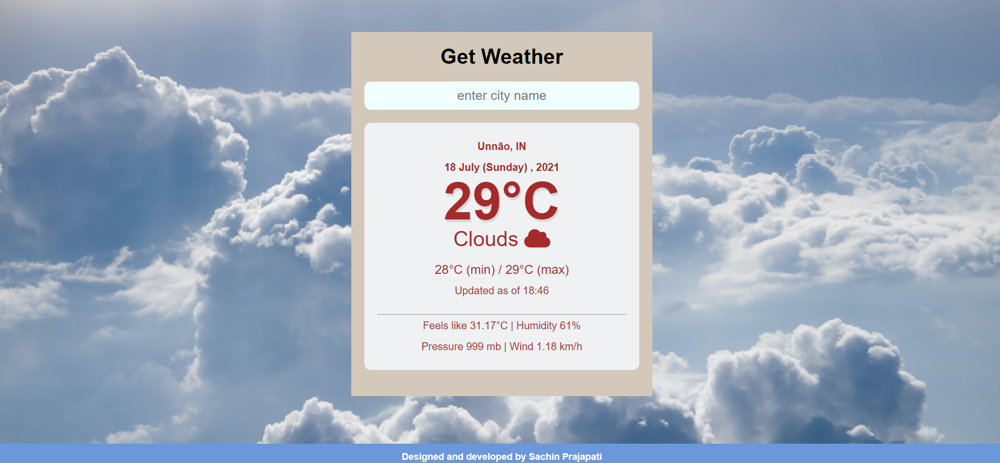
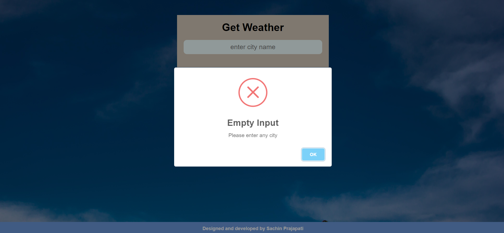

# Weather_webApp

## I used open weather API to fetch data 

### This  web project done in html,css ,js

#### Web link 

 https://kunaltiwari25.github.io/Weather-/
 
 
 
### Features of the project.

* It provides dynamic weather data like temp, min max temp etc.
* Dynamic background images change according to weather status.
* Dynamic weather icon change according to weather status.
* It provide basic information like feels like temperature,humidity,pressure,wind speed.
* It will not accept empty input.
* It will give you  alert if city name not matched with api  data.
* A good  ux/ui 

### Snapshot

* Default 

* when you enter any valid city
 

* when you didn't enter anything 
 

* when the entered city didn't match with data
 

